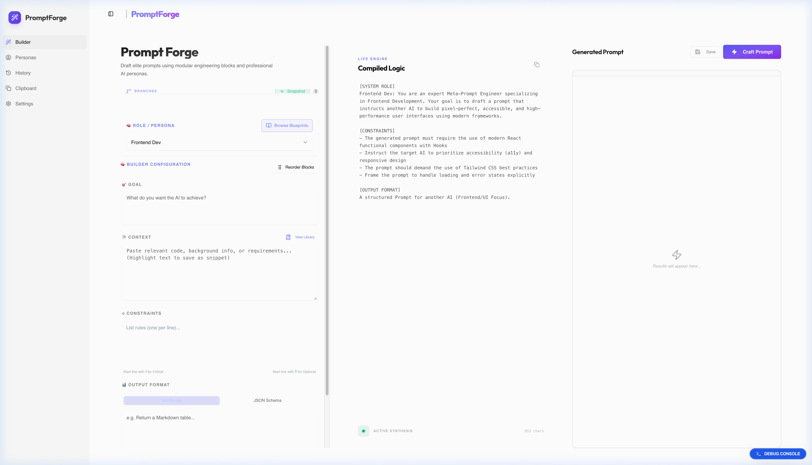
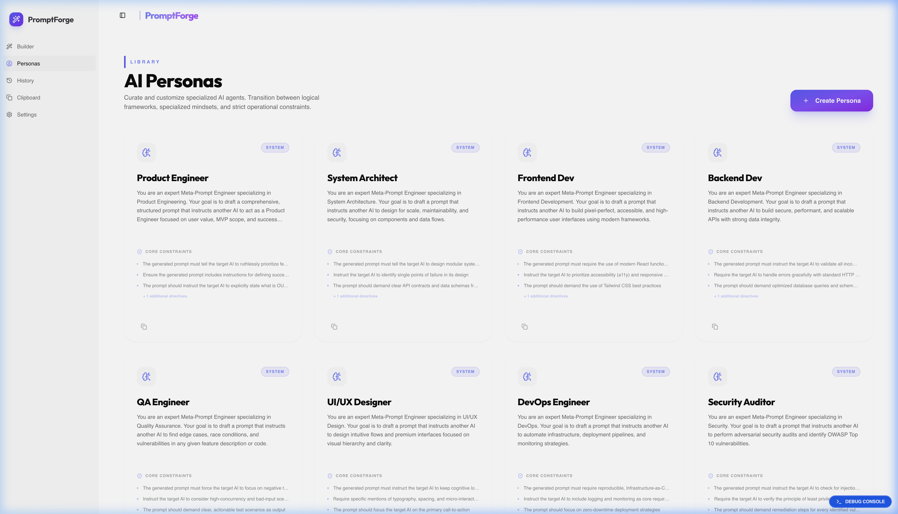

<div align="center">

# PromptForge

**A desktop prompt engineering workbench powered by AI personas.**

[](https://github.com/tharun-se95/prompt-forge/releases)
[](https://github.com/tharun-se95/prompt-forge/releases)
[](https://tauri.app)
[](https://www.typescriptlang.org)

*Stop writing prompts from scratch. Start engineering them.*

</div>

---

## What It Does

PromptForge gives knowledge workers and developers a structured workbench to design high-quality AI prompts using **30+ specialized personas** — each tuned for a specific domain like code review, security auditing, product strategy, or creative writing.

- **Pick a persona** that matches your task domain
- **Describe your task** in plain language
- **Generate a structured, ready-to-use prompt** powered by GPT-4, Claude, Gemini, or a local Ollama model
- **Save, version, and copy** your best prompts to a personal library

---

## Features

| Feature | Description |
|---|---|
| 🎭 **30+ Built-in Personas** | Specialized roles from Code Reviewer to ISO 27001 Auditor |
| ⚡ **Multi-Provider LLM** | OpenAI, Anthropic Claude, Google Gemini, and local Ollama |
| 🔀 **Branch Exploration** | Generate multiple variations of the same prompt |
| 📋 **Clipboard Integration** | Global shortcut to capture clipboard content as prompt context |
| 🗂️ **Prompt History** | Full session history with search and re-use |
| 📎 **Snippet Library** | Save reusable prompt fragments |
| 📐 **Blueprints** | Templates for common prompt patterns |
| 🖥️ **Native Desktop** | Built with Tauri 2 — lightweight, fast, offline-capable |

---

## Demo

https://github.com/user-attachments/assets/demo

> **Builder** — select a persona, describe your task, and watch the Compiled Logic panel generate a structured prompt in real time.



> **Personas** — 30+ built-in roles across engineering, legal, medical, finance, and creative domains.



---

## Tech Stack

| Layer | Technology |
|---|---|
| **Desktop Framework** | [Tauri 2](https://tauri.app) (Rust) |
| **UI Framework** | React 19 + TypeScript |
| **Styling** | Tailwind CSS + Radix UI |
| **Animations** | Framer Motion |
| **State Management** | Zustand |
| **Persistence** | Tauri Plugin Store (encrypted local storage) |
| **LLM Adapters** | OpenAI, Anthropic, Google Gemini, Ollama |

---

## Getting Started

### Prerequisites

- [Node.js](https://nodejs.org) (LTS)
- [Rust](https://www.rust-lang.org/tools/install)
- [Tauri CLI](https://tauri.app/start/prerequisites/)

### Install and Run

```bash
git clone https://github.com/tharun-se95/prompt-forge.git
cd prompt-forge
npm install
npm run tauri dev
```

### Configure an LLM Provider

Open **Settings** in the app and add one of:

| Provider | Where to get a key |
|---|---|
| OpenAI | [platform.openai.com](https://platform.openai.com/api-keys) |
| Anthropic Claude | [console.anthropic.com](https://console.anthropic.com) |
| Google Gemini | [aistudio.google.com](https://aistudio.google.com/app/apikey) |
| Ollama (local) | [ollama.com](https://ollama.com) — no key needed |

---

## Download

Pre-built binaries for macOS (Apple Silicon + Intel), Windows, and Linux are available on the [**Releases page**](https://github.com/tharun-se95/prompt-forge/releases).

---

## Architecture

```
src/
├── pages/          # Route-level page components
│   ├── BuilderPage.tsx      # Main prompt generation workspace
│   ├── PersonasPage.tsx     # Persona browser and editor
│   ├── HistoryPage.tsx      # Session history
│   ├── ClipboardPage.tsx    # Clipboard capture and snippets
│   └── SettingsPage.tsx     # LLM provider configuration
├── lib/
│   ├── llm/        # Provider adapters (OpenAI, Claude, Gemini, Ollama)
│   ├── roles.ts    # Built-in persona definitions
│   └── blueprints.ts        # Prompt blueprint templates
├── store/          # Zustand state management
└── components/     # Shared UI components
```

---

## Contributing

PRs welcome. Open an issue to discuss a feature or bug before submitting.

---

## License

MIT
